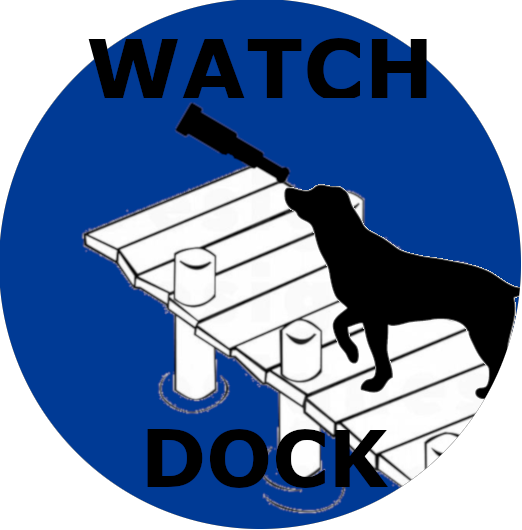
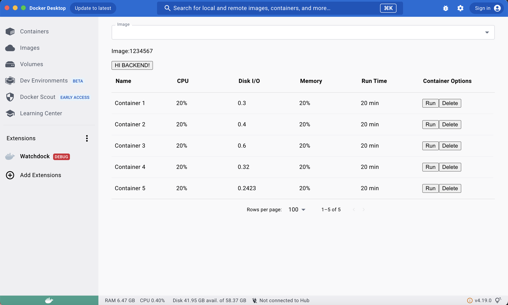
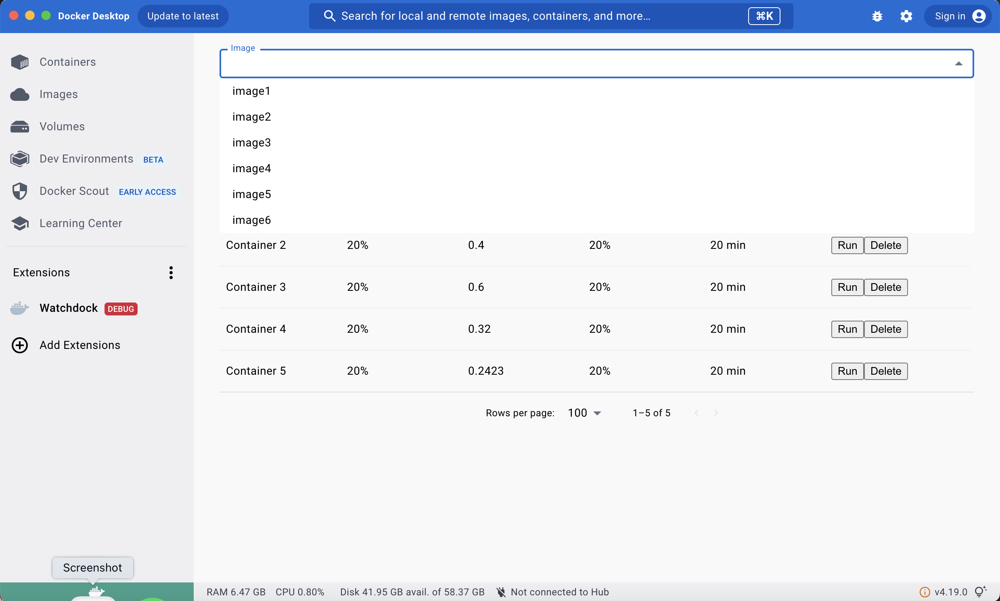

## Watchdock
Watchdock is a Docker Desktop extension that helps manage images and containers and view image and container metrics. We created this to provide a simplified user experience so that developers can focus on creating applications instead of managing their images/containers. Watchdock is a multi-container application that has a frontend container, backend container, and database container that all communicate with each other. Its frontend is built with React and TypeScript and the backend is built with TypeScript and Node.js. Useful metrics available include CPU, Disk I/O, Memory, and Runtime. 

<!-- ### Watchdock -->
  

  
  

### Product in Action

  

    
  

  

    
  

<!-- ---
  

      
  

---
Fun huh? 😁
  
  

      
  
 -->

<!-- [Guidance on how to create screen share GIFs](https://www.howtogeek.com/286210/how-to-turn-your-computer-screen-into-an-animated-gif/) -->

## Instructions
<!-- Your README should include instructions on using the product. These should be as detailed and user-friendly as possible, and include all of the following: -->
__Installation__

1. Initial setup instructions: After cloning repo, run npm install in root directory. Make sure Docker Desktop is running. 

2. Then simply go to Docker Desktop and explore the Watchdock application in the Extensions section!

__Running the Application__ 

1. The dashboard shows all containers and their metrics including container Name, CPU, Disk I/O, Memory, and Runtime.

2. In the container options column, users can choose to Run or Delete specific containers.

3. The Image dropdown menu at the top allows users to view specific images. 

<!-- 1. Usage guidelines
    - Walkthrough of how to use the application (this should focus on highlighting its main features).

1. Links to other documentation that one might need to better understand your product (links to React docs, Stack Overflow posts, etc). -->

<!-- 1. __Pro Tip:__ While not a requirement, another great feature is to add a link to a demo of your tool. Easiest way to do this is by publishing a demo on youtube and linking to that youtube video.
    - Example:
   -->

## Open Source Information
All contribution requests are reviewed and welcomed! 😊

  - Contribution guidelines:
    - Clone the repo to your machine and create a feature branch from the dev branch, naming it as the feature that is being worked on
    - After completing changes, submit a pull request using the PR template provided
    - Changes will be reviewed by main contributors

| Feature                                                                               | Status    |
|---------------------------------------------------------------------------------------|-----------|
| Access container/image metric data from backend                                       | ⏳        |
| Dynamic data visualization dashboard using D3                                         | 🙏🏻        |
| Use Twilio to send notications when memory is low                                     | 🙏🏻        |

<!-- - ✅ = Ready to use -->
- ⏳ = In progress
- 🙏🏻 = Looking for contributors

<!-- ## License Information

Open source licensing information is needed in your repository to make it easier for other people to contribute. If you have not already added this manually, Github makes it really easy. 

1. Go to your OSP's main GitHub page and click _"Add file"_ at the top of the page and select _"create new file"_. 

1. Next, name the file _"LICENSE.md"_ (in all caps). 

1. Once you do this you will see a _"Choose a license template"_ menu pop up. Click it and select "MIT License".

1. Finally, commit your new licensing file to your main repo, and you are set 😼 -->

## Contributor Information
<!-- Include a list of everyone who has contributed to the product (i.e. your OSP group members, and any previous groups if it is an iteration) Things that should be included here: 
1. Each person’s full name
1. Github handle
1. Photo (optional)
1. Other relevant links (i.e. LinkedIn, Personal Website, etc)

- Example: -->
  <table>
  <tr>
    <td align="center">
      
       
      <b>Blessing Ntekume</b>
       
      <a href="https://www.linkedin.com/in/bntekume/">🖇️</a>
      <a href="https://github.com/blessingnt">🐙</a>
    </td>
    <td align="center">
      
       
      <b>Cristian Corrales</b>
       
      <a href="https://www.linkedin.com/in/criscorr/">🖇️</a>
      <a href="https://github.com/crisdevs">🐙</a>
    </td>
    <td align="center">
      
       
      <b>Jonathan Nevarez</b>
       
      <!-- <a href="http://www.philliptroutman.info">💻</a> -->
      <a href="https://www.linkedin.com/in/john-nevarez/">🖇️</a>
      <a href="https://github.com/Nevjon12">🐙</a>
    </td>
     <td align="center">
      
       
      <b>Jenny Schmalz</b>
       
      <a href="https://www.linkedin.com/in/jennyschmalz/">🖇️</a>
      <a href="https://github.com/jennyschmalz">🐙</a>
    </td>
  </tr>
</table>

- 💻 = Website
- 🖇️ = LinkedIn
- 🐙 = Github

<!-- ## Other 
Some other possible additions to your README, which are optional but can be good to include:
- FAQ 
- Links to various publications (Medium Articles, Twitter pages, etc)
- Table of contents at the beginning of your README (with example)
  - Example:
    - [Instruction](#instructions)
    - [Product Description](#product-description)
    - [Open Source Information](#open-source-information)
- Badges 
  - Add some cool [Badges to your README](https://github.com/alexandresanlim/Badges4-README.md-Profile) -->

<!-- ## Examples of great READMEs
Check out this list of great READMEs for some extra inspo 😎
[LIST](https://github.com/matiassingers/awesome-readme)
 -->

